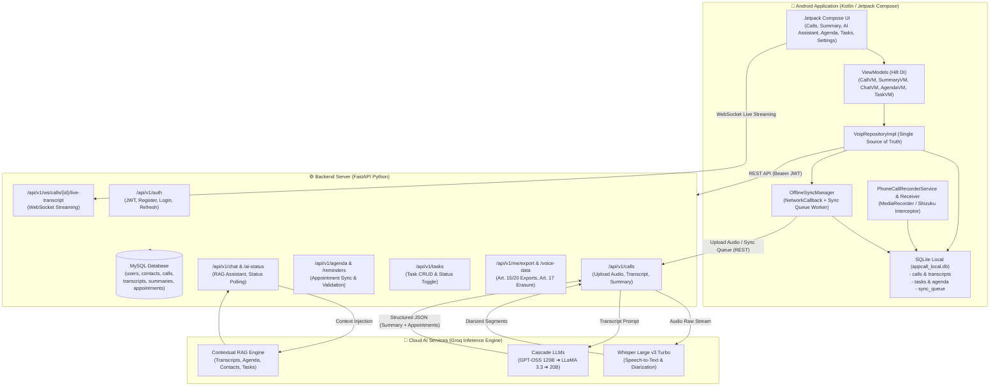
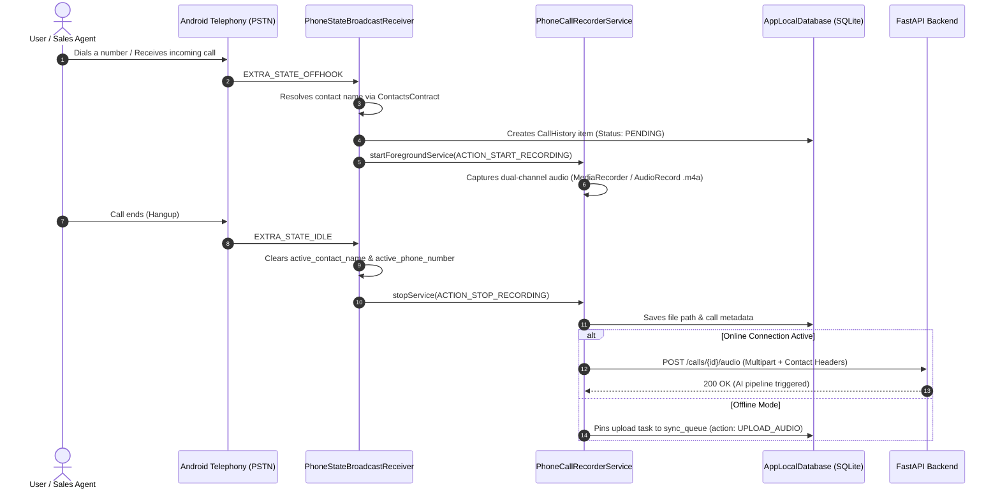
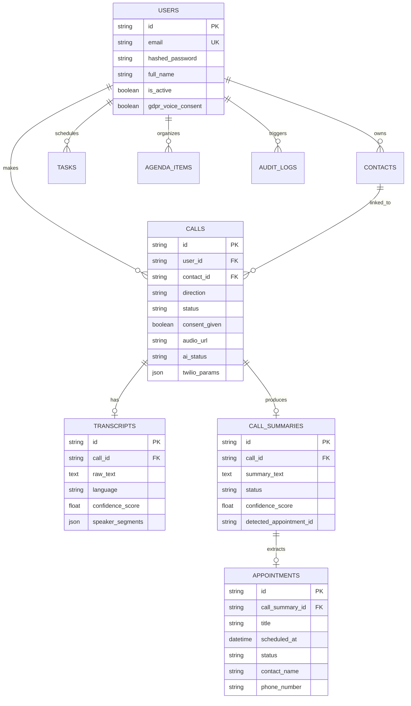
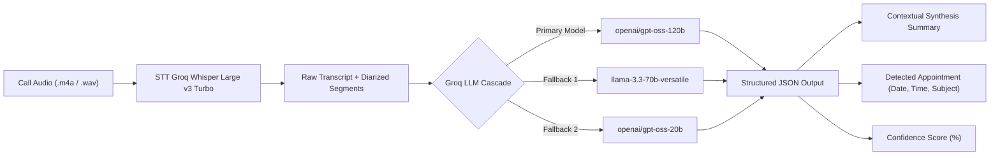

# 🏛️ Comprehensive Technical Architecture Documentation
## Intelligent Calls — AI-Powered Telephony, Real-Time STT Transcription & LLM Intelligence

---

## 📑 Table of Contents

1. [System Overview](#1-system-overview)
2. [Global Architecture Diagram](#2-global-architecture-diagram)
3. [Android Client Architecture](#3-android-client-architecture)
   - [3.1 Layered Architecture (Clean Architecture)](#31-layered-architecture-clean-architecture)
   - [3.2 Call Interception & Recording Lifecycle](#32-call-interception--recording-lifecycle)
   - [3.3 Offline-First Engine & Bidirectional Synchronization](#33-offline-first-engine--bidirectional-synchronization)
   - [3.4 Local SQLite Database Schema](#34-local-sqlite-database-schema)
4. [FastAPI Backend Architecture](#4-fastapi-backend-architecture)
   - [4.1 Modular Router Design](#41-modular-router-design)
   - [4.2 Relational Data Model (MySQL / SQLAlchemy)](#42-relational-data-model-mysql--sqlalchemy)
   - [4.3 Security & GDPR Compliance](#43-security--gdpr-compliance)
5. [Artificial Intelligence & Voice Processing Pipeline](#5-artificial-intelligence--voice-processing-pipeline)
   - [5.1 Speech-to-Text (Groq Whisper Large v3 Turbo)](#51-speech-to-text-groq-whisper-large-v3-turbo)
   - [5.2 Call Summarization & Appointment Extraction (Cascade LLMs)](#52-call-summarization--appointment-extraction-cascade-llms)
   - [5.3 Contextual RAG Assistant](#53-contextual-rag-assistant)
6. [API Endpoints Reference (35/35 Operational)](#6-api-endpoints-reference-3535-operational)
7. [Installation & Deployment Quickstart](#7-installation--deployment-quickstart)

---

## 1. System Overview

**Intelligent Calls** is an end-to-end intelligent telephony platform combining native mobile call interception, high-speed cloud speech-to-text (STT), automated AI call summarization, ISO-8601 appointment extraction, and a Retrieval-Augmented Generation (RAG) conversational assistant.

The platform is designed following strict **Offline-First**, **Zero-Placeholder / Zero Mock Data**, and **Full GDPR Compliance (Articles 15, 17, and 20)** principles.

```
┌────────────────────────────────────────────────────────────────────────┐
│                      INTELLIGENT CALLS ECOSYSTEM                       │
├────────────────────────────────────────────────────────────────────────┤
│  [Android Client]           [FastAPI Backend]        [Groq AI Engines] │
│  - Jetpack Compose UI       - 35 REST Endpoints      - Whisper v3 Turbo│
│  - Broadcast & Shizuku      - Live WebSockets        - LLaMA 3.3 70B   │
│  - SQLite Cache & Sync      - SQLAlchemy + MySQL     - GPT-OSS Cascade │
└────────────────────────────────────────────────────────────────────────┘
```

---

## 2. Global Architecture Diagram



---

## 3. Android Client Architecture

### 3.1 Layered Architecture (Clean Architecture)

The Android application is structured according to modern Android development best practices:
- **Presentation Layer**: Jetpack Compose with Material 3, reactive state management using `StateFlow`.
- **Domain Layer**: Pure Kotlin domain models (`DomainModels.kt`) and repository contracts (`VoipRepository`).
- **Data Layer**: Retrofit/OkHttp network interfaces (`ApiService`), local SQLite database (`AppLocalDatabase`), encrypted token storage (`TokenStorage`).
- **Dependency Injection**: Hilt / Dagger for singleton and ViewModel injection.

```
com.example.appcall/
├── data/
│   ├── api/                 # Retrofit Interfaces, Dynamic URL Interceptor, WebSockets
│   ├── calling/             # Native PSTN & Shizuku Interception Services
│   ├── local/               # AppLocalDatabase (SQLite v8 Offline-First Engine)
│   ├── model/               # Network DTOs (NetworkModels.kt)
│   ├── reminder/            # AlarmManager for Appointment Reminders
│   ├── repository/          # VoipRepositoryImpl, TokenStorage
│   └── sync/                # OfflineSyncManager (Auto-Sync Queue Worker)
├── domain/
│   ├── model/               # Pure Domain Entities (DomainModels.kt)
│   └── repository/          # VoipRepository.kt Contract
└── presentation/
    ├── auth/                # Login & Registration Screens
    ├── calling/             # CallScreen, CallHistoryScreen, ActiveCall
    ├── summary/             # SummaryScreen & SummaryViewModel
    ├── navigation/          # Navigation Graph
    └── theme/               # Dark HSL Color Tokens, Typography
```

### 3.2 Call Interception & Recording Lifecycle



### 3.3 Offline-First Engine & Bidirectional Synchronization

The [OfflineSyncManager.kt](file:///c:/Users/khali/OneDrive/Bureau/intelligentCall/IntelligentCalls/app/src/main/java/com/example/appcall/data/sync/OfflineSyncManager.kt) component guarantees full functionality when offline:

1. **Active Network Monitoring**: `ConnectivityManager.NetworkCallback` monitors real-time internet connectivity.
2. **Persistent Queue (`sync_queue`)**: All offline mutations (audio uploads, task creation/completion, appointment validation, summary edits) are written directly to local disk.
3. **Upstream Synchronization (Push)**: Once connection is restored, pending queue items are processed chronologically.
4. **Downstream Synchronization (Pull)**: The app queries the backend to pull newly generated AI summaries and transcripts down to local SQLite storage.

### 3.4 Local SQLite Database Schema (`appcall_local.db`)

| Table | Purpose | Key Columns |
| :--- | :--- | :--- |
| `calls` | Cached summaries & transcripts | `call_id`, `summary_text`, `confidence_score`, `summary_status`, `raw_transcript`, `speaker_segments` |
| `sync_queue` | Offline action queue | `sync_id`, `call_id`, `action_type`, `file_path`, `payload` |
| `call_history` | Call logs | `hist_id`, `contact_id`, `contact_name`, `direction`, `status`, `started_at`, `ended_at` |
| `tasks` | To-Do task management | `task_id`, `title`, `completed` |
| `agenda` | Appointments & calendar | `agenda_id`, `title`, `scheduled_at`, `contact_name`, `phone_number`, `status` |
| `chat_history` | AI Assistant message history | `chat_id`, `session_id`, `contact_id`, `is_user`, `text`, `sources_json`, `created_at` |

---

## 4. FastAPI Backend Architecture

### 4.1 Modular Router Design

```
backend/
├── app/
│   ├── ai/
│   │   ├── chatbot.py           # RAG Assistant & Contextual Response Generator
│   │   ├── summarizer.py        # Summary & ISO-8601 Appointment Extractor (Cascade LLM)
│   │   └── transcriber.py       # Groq Whisper STT & Fallback Engines
│   ├── routers/
│   │   ├── agenda.py            # Calendar & Appointment Endpoints
│   │   ├── auth.py              # JWT Authentication & Registration
│   │   ├── calls.py             # Calls, Audio Upload & Transcripts
│   │   ├── chat.py              # AI Assistant Endpoints
│   │   ├── contacts.py          # Contact Management & GDPR Consent
│   │   ├── files.py             # File Storage & Attachments
│   │   ├── gdpr.py              # GDPR Export & Erasure (Art. 15, 17, 20)
│   │   ├── reminders.py         # Reminders & Notifications
│   │   ├── tasks.py             # Task CRUD (To-Do)
│   │   ├── users.py             # User Profile & Password Management
│   │   ├── voip.py              # WebRTC / VoIP Tokens
│   │   ├── webhooks.py          # Twilio & Vonage Webhooks
│   │   └── ws.py                # Live Streaming WebSocket
│   ├── database.py              # SQLAlchemy Models & MySQL Engine
│   ├── gdpr.py                  # GDPR Audit & Export Engine
│   └── main.py                  # FastAPI Application Entry & CORS Middlewares
├── audit_routes.py              # Integration Test Suite (35 Endpoints)
└── uploads/                     # Audio File Storage Directory
```

### 4.2 Relational Data Model (MySQL)



### 4.3 Security & GDPR Compliance

- **Secure Authentication**: JWT with HMAC-SHA256 tokens and `bcrypt` password hashing.
- **Explicit Voice Consent**: Audio recording is gated by user and contact GDPR consent (`consent_given=True`, timestamped).
- **Right to Access & Portability (Articles 15 & 20)**: Endpoints `/api/v1/me/export` and `/api/v1/users/me/voice-data/export` produce structured JSON data archives.
- **Right to Erasure (Article 17)**: Endpoint `DELETE /api/v1/users/me/voice-data` permanently purges all audio files, transcripts, and summaries.

---

## 5. Artificial Intelligence & Voice Processing Pipeline



### 5.1 Speech-to-Text (Groq Whisper Large v3 Turbo)
- **Engine**: Groq `whisper-large-v3-turbo` with multi-speaker diarization.
- **Performance**: Processing speed ~1.1s for 60s of audio.
- **Confidence Score**: Calculated across all speech segments (Average: > 96%).

### 5.2 Call Summarization & Appointment Extraction
The [summarizer.py](file:///c:/Users/khali/OneDrive/Bureau/intelligentCall/backend/app/ai/summarizer.py) module runs optimized prompts to extract:
- A concise summary of commitments and discussion points.
- Strict appointment extraction formatted in ISO-8601 (`YYYY-MM-DDTHH:MM:SS`).
- Status classification (`PROPOSED` $\rightarrow$ `CONFIRMED` $\rightarrow$ `VALIDATED`).

### 5.3 Contextual RAG Assistant
The [chatbot.py](file:///c:/Users/khali/OneDrive/Bureau/intelligentCall/backend/app/ai/chatbot.py) module dynamically queries the user's complete data context:
1. **Device & Server Contacts**.
2. **Recent Call Transcripts and Audio Logs**.
3. **Agenda & Scheduled Appointments**.
4. **Active and Completed Tasks**.

---

## 6. API Endpoints Reference (35/35 Operational)

| Category | Method | Endpoint | Description |
| :--- | :---: | :--- | :--- |
| **Health** | `GET` | `/health` | Server and database healthcheck |
| **Auth** | `POST` | `/api/v1/auth/register` | Register new user account |
| | `POST` | `/api/v1/auth/login` | Authenticate and obtain JWT token |
| | `POST` | `/api/v1/auth/refresh` | Refresh expired JWT token |
| **Users** | `GET` | `/api/v1/users/me` | Fetch current user profile |
| | `PUT` | `/api/v1/users/me` | Update user profile info |
| | `PUT` | `/api/v1/users/me/password` | Change user password |
| **VoIP / WebRTC** | `GET` | `/api/v1/voip/token` | Generate WebRTC call token |
| **Contacts** | `GET` | `/api/v1/contacts` | List contacts |
| | `POST` | `/api/v1/contacts` | Create a new contact |
| | `PATCH` | `/api/v1/contacts/{id}/gdpr-consent` | Update contact GDPR consent |
| **Calls** | `POST` | `/api/v1/calls` | Initialize a call session |
| | `GET` | `/api/v1/calls/{id}` | Get call details |
| | `GET` | `/api/v1/calls` | Paginated call history list |
| | `POST` | `/api/v1/calls/{id}/audio` | Upload recorded audio file |
| | `POST` | `/api/v1/calls/{id}/consent` | Record call recording consent |
| | `POST` | `/api/v1/calls/{id}/end` | Mark call as completed |
| | `GET` | `/api/v1/calls/{id}/transcript` | Retrieve diarized transcript |
| | `GET` | `/api/v1/calls/{id}/summary` | Retrieve summary and extracted appointment |
| | `POST` | `/api/v1/calls/{id}/summary/validate` | Approve and archive summary |
| | `POST` | `/api/v1/calls/{id}/summary/edit` | Edit summary text manually |
| | `GET` | `/api/v1/calls/{id}/ai-status` | Poll AI processing status |
| **Agenda** | `GET` | `/api/v1/agenda` | List synchronized appointments |
| | `POST` | `/api/v1/agenda` | Create an appointment |
| | `GET` | `/api/v1/reminders` | List active reminders |
| **Tasks** | `GET` | `/api/v1/tasks` | List tasks |
| | `POST` | `/api/v1/tasks` | Create a task |
| | `PUT` | `/api/v1/tasks/{id}` | Update / toggle task completion |
| | `DELETE` | `/api/v1/tasks/{id}` | Delete a task |
| **Files** | `GET` | `/api/v1/files` | List uploaded files |
| | `POST` | `/api/v1/files` | Upload a file |
| **GDPR** | `GET` | `/api/v1/me/export` | Complete data export archive (Art. 15/20) |
| | `GET` | `/api/v1/users/me/voice-data/export` | Export voice and audio data archive |
| | `DELETE` | `/api/v1/users/me/voice-data` | Right to be forgotten / Purge voice data (Art. 17) |
| **Webhooks** | `POST` | `/webhooks/twilio/voice` | Twilio voice webhook (TwiML) |
| | `POST` | `/webhooks/vonage/voice` | Vonage voice webhook (NCCO) |
| | `POST` | `/webhooks/recording-complete` | Recording complete webhook |
| **WebSocket** | `WS` | `/api/v1/ws/calls/{id}/live-transcript` | Real-time live transcript stream |

---

## 7. Installation & Deployment Quickstart

### Prerequisites
- **Python** $\ge 3.10$ with MySQL Server (or MariaDB / SQLite)
- **Android Studio** (Hedgehog / Ladybug) with Android SDK 34 / 35
- **Groq API Key** for Whisper & LLaMA acceleration

### Launch Backend
```bash
cd backend
python -m venv venv
venv\Scripts\activate  # On Windows (or source venv/bin/activate on Linux)
pip install -r requirements.txt

# Run complete 35/35 integration audit
python audit_routes.py

# Start live server
python -m uvicorn app.main:app --host 0.0.0.0 --port 8000 --reload
```

### Build Android App
```bash
cd IntelligentCalls
./gradlew :app:assembleDebug
```
The compiled APK will be located at `IntelligentCalls/app/build/outputs/apk/debug/app-debug.apk`.
