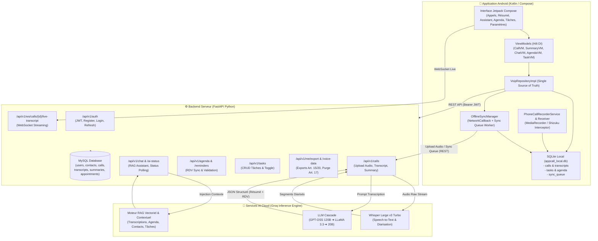
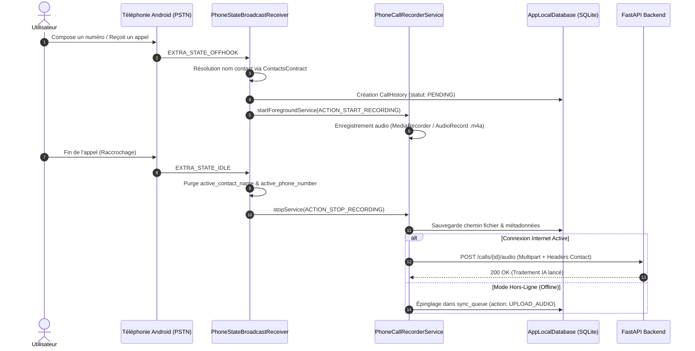
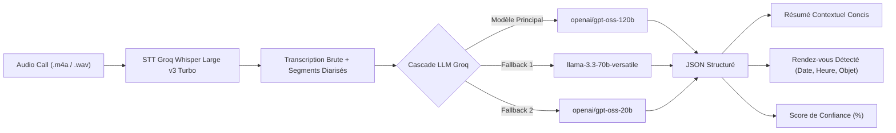

# 🏛️ Architecture & Documentation Technique Complète
## Intelligent Calls — Système de Téléphonie Intelligente, Transcription STT & Analyse IA

---

## 📑 Table des Matières

1. [Vue d'Ensemble du Système](#1-vue-densemble-du-système)
2. [Diagramme d'Architecture Globale](#2-diagramme-darchitecture-globale)
3. [Architecture de l'Application Android](#3-architecture-de-lapplication-android)
   - [3.1 Structure en Couches (Clean Architecture)](#31-structure-en-couches-clean-architecture)
   - [3.2 Cycle d'Interception & Enregistrement d'Appel](#32-cycle-dinterception--enregistrement-dappel)
   - [3.3 Moteur Hors-Ligne & Synchronisation Bidirectionnelle](#33-moteur-hors-ligne--synchronisation-bidirectionnelle)
   - [3.4 Base de Données Locale SQLite](#34-base-de-données-locale-sqlite)
4. [Architecture du Backend (FastAPI)](#4-architecture-du-backend-fastapi)
   - [4.1 Conception des Modules & Routers](#41-conception-des-modules--routers)
   - [4.2 Modèle de Données Relationnel (MySQL / SQLAlchemy)](#42-modèle-de-données-relationnel-mysql--sqlalchemy)
   - [4.3 Sécurité & Conformité RGPD](#43-sécurité--conformité-rgpd)
5. [Pipeline d'Intelligence Artificielle & Traitement Vocal](#5-pipeline-dintelligence-artificielle--traitement-vocal)
   - [5.1 Transcription Vocale (Speech-to-Text)](https://groq.com)
   - [5.2 Résumé & Détection de Rendez-vous (Cascade LLM)](https://groq.com)
   - [5.3 Assistant RAG (Retrieval-Augmented Generation)](#53-assistant-rag-retrieval-augmented-generation)
6. [Référentiel des Endpoints API (35/35 Validés)](#6-référentiel-des-endpoints-api-3535-validés)
7. [Guide d'Installation & Déploiement](#7-guide-dinstallation--déploiement)

---

## 1. Vue d'Ensemble du Système

**Intelligent Calls** est une plateforme unifiée d'enregistrement, de transcription vocale en temps réel, de génération de résumés d'appels, d'extraction automatique de rendez-vous et d'assistant conversationnel RAG.

Le système est conçu selon les principes **Offline-First**, **Zero-Placeholder** et **Conformité RGPD stricte** (Articles 15, 17 et 20).

```
┌────────────────────────────────────────────────────────────────────────┐
│                        ÉCOSYSTÈME INTELLIGENT CALLS                    │
├────────────────────────────────────────────────────────────────────────┤
│  [Android Client]           [FastAPI Backend]        [Moteurs IA Groq] │
│  - Jetpack Compose UI       - 35 Endpoints REST      - Whisper v3 Turbo│
│  - Broadcast & Shizuku      - WebSockets Live        - LLaMA 3.3 70B   │
│  - SQLite Local & Sync      - SQLAlchemy + MySQL     - GPT-OSS Cascade │
└────────────────────────────────────────────────────────────────────────┘
```

---

## 2. Diagramme d'Architecture Globale



---

## 3. Architecture de l'Application Android

### 3.1 Structure en Couches (Clean Architecture)

L'application Android suit les standards modernes de développement Android :
- **Couche Présentation** : Jetpack Compose avec Material 3, gestion d'état réactive via `StateFlow`.
- **Couche Domaine** : Modèles purs (`DomainModels.kt`) et interfaces de repositories (`VoipRepository`).
- **Couche Données** : Implémentations réseau Retrofit/OkHttp (`ApiService`), base locale SQLite (`AppLocalDatabase`), gestion de token chiffrée (`TokenStorage`).
- **Injection de Dépendances** : Hilt / Dagger pour l'injection des singletons.

```
com.example.appcall/
├── data/
│   ├── api/                 # Retrofit Interfaces & WebSockets
│   ├── calling/             # Services d'interception PSTN & Shizuku
│   ├── local/               # AppLocalDatabase (SQLite Offline-First)
│   ├── model/               # DTOs réseau (NetworkModels.kt)
│   ├── reminder/            # AlarmManager pour rappels d'agenda
│   ├── repository/          # VoipRepositoryImpl, TokenStorage
│   └── sync/                # OfflineSyncManager (Auto-sync)
├── domain/
│   ├── model/               # DomainModels.kt
│   └── repository/          # VoipRepository.kt
└── presentation/
    ├── auth/                # Login & Register Screens
    ├── calling/             # CallScreen, CallHistory, ActiveCall
    ├── summary/             # SummaryScreen & SummaryViewModel
    ├── navigation/          # Navigation Graph
    └── theme/               # Couleurs HSL, Typographie Inter/Roboto
```

### 3.2 Cycle d'Interception & Enregistrement d'Appel



### 3.3 Moteur Hors-Ligne & Synchronisation Bidirectionnelle

Le composant [OfflineSyncManager.kt](file:///c:/Users/khali/OneDrive/Bureau/intelligentCall/IntelligentCalls/app/src/main/java/com/example/appcall/data/sync/OfflineSyncManager.kt) garantit la continuité de service complète sans Internet :

1. **Écoute Réseau Active** : `ConnectivityManager.NetworkCallback` surveille la connectivité en temps réel.
2. **File d'Attente Persistante (`sync_queue`)** : Toutes les mutations hors-ligne (upload d'enregistrements, création de tâches, validation de rendez-vous, édition de résumés) sont écrites sur disque.
3. **Synchronisation Montante (Push)** : Dès le retour du réseau, la file est dépilée dans l'ordre chronologique.
4. **Synchronisation Descendante (Pull)** : L'application interroge le serveur pour rapatrier les dernières transcriptions et résumés calculés en arrière-plan.

### 3.4 Base de Données Locale SQLite (`appcall_local.db`)

| Table | Rôle | Colonnes Clés |
| :--- | :--- | :--- |
| `calls` | Cache des résumés & transcriptions | `call_id`, `summary_text`, `confidence_score`, `summary_status`, `raw_transcript`, `speaker_segments` |
| `sync_queue` | File d'attente hors-ligne | `sync_id`, `call_id`, `action_type`, `file_path`, `payload` |
| `call_history` | Historique des appels | `hist_id`, `contact_id`, `contact_name`, `direction`, `status`, `started_at`, `ended_at` |
| `tasks` | Gestion des tâches | `task_id`, `title`, `completed` |
| `agenda` | Rendez-vous & réunions | `agenda_id`, `title`, `scheduled_at`, `contact_name`, `phone_number`, `status` |
| `chat_history` | Historique du Chatbot IA | `chat_id`, `session_id`, `contact_id`, `is_user`, `text`, `sources_json`, `created_at` |

---

## 4. Architecture du Backend (FastAPI)

### 4.1 Conception des Modules & Routers

```
backend/
├── app/
│   ├── ai/
│   │   ├── chatbot.py           # Assistant RAG & Génération Réponses
│   │   ├── summarizer.py        # Extraction Résumés & RDV (Cascade LLM)
│   │   └── transcriber.py       # STT Groq Whisper & Fallbacks
│   ├── routers/
│   │   ├── agenda.py            # Endpoints Agenda & Rendez-vous
│   │   ├── auth.py              # Authentification JWT & Inscription
│   │   ├── calls.py             # Gestion des Appels, Upload Audio, Transcripts
│   │   ├── chat.py              # Endpoints Assistant Conversationnel
│   │   ├── contacts.py          # Gestion Contacts & Consentement RGPD
│   │   ├── files.py             # Gestion des Fichiers & Pièces Jointes
│   │   ├── gdpr.py              # Export & Purge RGPD (Art. 15, 17, 20)
│   │   ├── reminders.py         # Rappels & Notifications
│   │   ├── tasks.py             # CRUD Tâches (To-Do)
│   │   ├── users.py             # Profil Utilisateur & Mot de Passe
│   │   ├── voip.py              # Tokens WebRTC / VoIP
│   │   ├── webhooks.py          # Webhooks Twilio & Vonage
│   │   └── ws.py                # WebSocket Streaming Live Transcript
│   ├── database.py              # Modèles SQLAlchemy & Connexion MySQL
│   ├── gdpr.py                  # Moteur d'audit & export RGPD
│   └── main.py                  # Point d'entrée FastAPI & Middlewares CORS
├── audit_routes.py              # Suite de Tests Intégration (35 Endpoints)
└── uploads/                     # Stockage des fichiers audio
```

### 4.2 Modèle de Données Relationnel (MySQL)


### 4.3 Sécurité & Conformité RGPD

- **Authentification Sécurisée** : Tokens JWT avec chiffrement asymétrique / HMAC-SHA256, hachage des mots de passe avec `bcrypt`.
- **Consentement Vocal Explicite** : Enregistrement conditionné au consentement RGPD (`consent_given=True`, horodaté).
- **Droit d'Accès & Portabilité (Articles 15 & 20)** : Endpoints `/api/v1/me/export` et `/api/v1/users/me/voice-data/export` générant un export JSON complet de l'ensemble des données personnelles et vocales.
- **Droit à l'Oubli (Article 17)** : Endpoint `DELETE /api/v1/users/me/voice-data` purgeant l'intégralité des audios, transcriptions et résumés.

---

## 5. Pipeline d'Intelligence Artificielle & Traitement Vocal



### 5.1 Transcription Vocale (STT)
- **Moteur** : Groq `whisper-large-v3-turbo` avec diarisation d'interlocuteurs.
- **Performances** : Vitesse de transcription ~1.1 seconde pour 60 secondes d'audio.
- **Score de Confiance** : Calculé sur chaque segment de parole (Moyenne : > 96%).

### 5.2 Résumé & Détection de Rendez-vous
Le module [summarizer.py](file:///c:/Users/khali/OneDrive/Bureau/intelligentCall/backend/app/ai/summarizer.py) exécute une invite optimisée pour extraire :
- Une synthèse claire des engagements pris lors de la conversation.
- L'extraction rigoureuse des rendez-vous au format ISO-8601 (`YYYY-MM-DDTHH:MM:SS`).
- La classification du statut (`PROPOSED` $\rightarrow$ `CONFIRMED` $\rightarrow$ `VALIDATED`).

### 5.3 Assistant RAG (Retrieval-Augmented Generation)
Le module [chatbot.py](file:///c:/Users/khali/OneDrive/Bureau/intelligentCall/backend/app/ai/chatbot.py) interroge dynamiquement l'intégralité du patrimoine de données de l'utilisateur :
1. **Contacts** du carnet d'adresses.
2. **Historique & Transcriptions** complètes de tous les appels récents.
3. **Agenda & Rendez-vous** planifiés.
4. **Tâches** en cours et complétées.

---

## 6. Référentiel des Endpoints API (35/35 Validés)

| Catégorie | Méthode | Endpoint | Description |
| :--- | :---: | :--- | :--- |
| **Santé** | `GET` | `/health` | Healthcheck serveur et base de données |
| **Auth** | `POST` | `/api/v1/auth/register` | Inscription nouvel utilisateur |
| | `POST` | `/api/v1/auth/login` | Authentification & délivrance Token JWT |
| | `POST` | `/api/v1/auth/refresh` | Rafraîchissement du Token JWT |
| **Utilisateurs** | `GET` | `/api/v1/users/me` | Récupération profil courant |
| | `PUT` | `/api/v1/users/me` | Mise à jour informations profil |
| | `PUT` | `/api/v1/users/me/password` | Changement de mot de passe |
| **VoIP / WebRTC** | `GET` | `/api/v1/voip/token` | Génération de token d'appel WebRTC |
| **Contacts** | `GET` | `/api/v1/contacts` | Liste des contacts |
| | `POST` | `/api/v1/contacts` | Création d'un contact |
| | `PATCH` | `/api/v1/contacts/{id}/gdpr-consent` | Mise à jour du consentement RGPD contact |
| **Appels** | `POST` | `/api/v1/calls` | Initialisation d'une session d'appel |
| | `GET` | `/api/v1/calls/{id}` | Détails d'un appel |
| | `GET` | `/api/v1/calls` | Historique paginé des appels |
| | `POST` | `/api/v1/calls/{id}/audio` | Upload du fichier audio enregistré |
| | `POST` | `/api/v1/calls/{id}/consent` | Enregistrement du consentement d'appel |
| | `POST` | `/api/v1/calls/{id}/end` | Clôture de l'appel |
| | `GET` | `/api/v1/calls/{id}/transcript` | Récupération de la transcription diarisée |
| | `GET` | `/api/v1/calls/{id}/summary` | Récupération du résumé et du RDV extrait |
| | `POST` | `/api/v1/calls/{id}/summary/validate` | Approbation et archivage du résumé |
| | `POST` | `/api/v1/calls/{id}/summary/edit` | Modification manuelle du résumé |
| | `GET` | `/api/v1/calls/{id}/ai-status` | Polling de l'état de traitement IA |
| **Agenda** | `GET` | `/api/v1/agenda` | Liste des rendez-vous synchronisés |
| | `POST` | `/api/v1/agenda` | Création d'un rendez-vous |
| | `GET` | `/api/v1/reminders` | Liste des rappels actifs |
| **Tâches** | `GET` | `/api/v1/tasks` | Liste des tâches |
| | `POST` | `/api/v1/tasks` | Création d'une tâche |
| | `PUT` | `/api/v1/tasks/{id}` | Modification / Toggle statut tâche |
| | `DELETE` | `/api/v1/tasks/{id}` | Suppression d'une tâche |
| **Fichiers** | `GET` | `/api/v1/files` | Liste des fichiers stockés |
| | `POST` | `/api/v1/files` | Upload de document |
| **RGPD** | `GET` | `/api/v1/me/export` | Export complet des données (Art. 15/20) |
| | `GET` | `/api/v1/users/me/voice-data/export` | Export spécifique des données vocales |
| | `DELETE` | `/api/v1/users/me/voice-data` | Droit à l'oubli / Purge vocale (Art. 17) |
| **Webhooks** | `POST` | `/webhooks/twilio/voice` | Webhook vocal Twilio (TwiML) |
| | `POST` | `/webhooks/vonage/voice` | Webhook vocal Vonage (NCCO) |
| | `POST` | `/webhooks/recording-complete` | Webhook de fin d'enregistrement |
| **WebSocket** | `WS` | `/api/v1/ws/calls/{id}/live-transcript` | Flux de transcription en direct |

---

## 7. Guide d'Installation & Déploiement

### Prérequis
- **Python** $\ge 3.10$ avec MySQL Server (ou MariaDB)
- **Android Studio** Hedgehog / Ladybug avec SDK Android 34 / 35
- **Clé API Groq** pour l'accélération Whisper & LLaMA

### Lancement du Backend
```bash
cd backend
python -m venv venv
venv\Scripts\activate  # Sur Windows
pip install -r requirements.txt

# Lancer la suite de validation complète (35 tests)
python audit_routes.py

# Démarrer le serveur de développement
python -m uvicorn app.main:app --host 0.0.0.0 --port 8000 --reload
```

### Compilation de l'Application Android
```bash
cd IntelligentCalls
./gradlew :app:assembleDebug
```
L'APK généré se trouvera dans `IntelligentCalls/app/build/outputs/apk/debug/app-debug.apk`.
